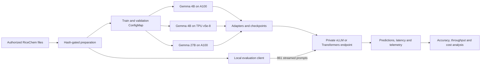

# Fine-tuning Gemma for RiceChem grading

This repository is the public artifact for Sean Yépez's ME344 custom-domain final project. It reproduces a supervised fine-tuning and systems experiment on **RiceChem**, a human-labeled benchmark for long-form chemistry grading.

The repository contains only the RiceChem experiment. It does **not** contain Treemarks product code, student records, RiceChem rows, model weights, credentials, private infrastructure identifiers, or frontier-model execution tooling.

## Executive summary

The experiment asks whether a smaller, fine-tuned open-weights model can perform rubric-level grading competitively with frontier models while reducing serving cost and increasing throughput.

- Workload: 6,700 labeled training decisions, 831 validation decisions, and a frozen 861-decision canonical test set.
- Task: determine whether each student response satisfies one TA-authored rubric criterion; accuracy is exact agreement with the released TA label.
- Compute: Gemma 3 4B on one A100 GPU and TPU v5e-8; Gemma 3 27B on one A100 GPU.
- Main result: fine-tuning Gemma 3 27B increased canonical-test agreement from **71.0% to 83.3%** (+12.3 percentage points; response-clustered 95% CI +8.9 to +15.8; permutation p = .0001).
- Frontier comparison: Claude Opus 5 reached 80.5% on the same canonical test. The canonical-test difference was directional but not statistically significant (p = .10), so the supported conclusion is **competitive with Opus**, not superior to it.
- Systems result: the measured 27B endpoint was limited by an unbatched serving configuration. Its observed throughput is not an A100 hardware ceiling.

RiceChem is an external research benchmark, not evidence that any model is ready for unsupervised grading of record. Labels come from one course TA and published inter-rater reliability is unavailable.

## System topology diagram



The raw dataset and canonical test rows remain on the authorized client. Training and validation are staged temporarily; the test prompts stream to private endpoints. No public model endpoint is required.

## Performance delta analysis

### Accuracy

| Model and setting | Canonical agreement |
|---|---:|
| Gemma 3 4B, base | 67.2% |
| Gemma 3 4B, fine-tuned on A100 | 71.8% |
| Gemma 3 4B, fine-tuned on TPU v5e-8 | 72.1% |
| Gemma 3 27B, base | 71.0% |
| **Gemma 3 27B, fine-tuned** | **83.3%** |
| Claude Opus 5, reference | 80.5% |
| Published fine-tuned RoBERTa record (2024) | 86.8% |

### Training and observed serving

| Lane | Training wall time | Training throughput | Observed inference throughput |
|---|---:|---:|---:|
| Gemma 3 4B, TPU v5e-8 | 43.7 min | 1,690 real tokens/s | 73.3 decisions/s |
| Gemma 3 4B, A100 | 90.7 min | 816 real tokens/s | 50.7 decisions/s |
| Gemma 3 27B, A100 | 3.07 h | 268 real tokens/s | 1.33 decisions/s† |
| Gemma 3 4B, CPU | Pending controlled full-test run | Pending | Pending |

†The 27B endpoint used unbatched Transformers generation. The 4B endpoints used vLLM with concurrent scheduling, so this is an observed deployment result rather than a controlled hardware ceiling.

Raw aggregate receipts are under [`results/`](results/). The controlled same-checkpoint CPU/GPU/TPU table will replace the pending row when the full 861-decision hardware run completes.

## Infrastructure bottleneck diagnosis

The primary measured serving bottleneck was the **unbatched 27B endpoint configuration**. Each request invoked generation separately, while the 4B vLLM deployments dynamically scheduled concurrent requests. This prevented the existing result from isolating model size from server design.

Training exposed two additional systems constraints:

1. Reading the model through an uncached object-store mount made TPU startup impractically slow. Enabling range-read file caching reduced model loading to seconds.
2. Pre-materializing JAX batches placed large attention masks in device HBM. Keeping batches in host NumPy memory and transferring them per step allowed the declared TPU batch to fit.

## Engineering mitigations

- Package dependencies in immutable CPU/GPU and TPU images; do not install packages inside running pods.
- Pin serving images and record their resolved digest.
- Use vLLM dynamic batching for throughput-oriented grading workloads.
- Keep preprocessing batches in host memory and transfer them per step.
- Cache large model reads close to the accelerator.
- Stream test prompts from the authorized client rather than storing test data with the serving system.
- Capture CPU, GPU and TPU utilization, peak memory, latency and throughput during the same-checkpoint comparison.
- Validate the 27B bottleneck with a batched vLLM deployment before treating its earlier throughput as a model-size result.

## Repository layout

```text
.
├── Dockerfile                 # CPU and GPU build targets
├── Dockerfile.tpu             # JAX/Tunix TPU training image
├── src/                       # preparation, training, evaluation and metrics
├── k8s/                       # generic GKE jobs and deployments
├── results/                   # aggregate, de-identified experiment receipts
├── figures/                   # presentation-ready charts
├── notebooks/                 # profiling analysis (consumes aggregate CSV)
├── slides/                    # final five-slide ME344 deck
└── docs/                      # protocol and limitations
```

## Data access and preparation

RiceChem is not redistributed here. Obtain authorized access from the dataset authors and follow their terms. Place the released `processed/` directory under a local dataset root, then run:

```bash
python src/prepare_ricechem.py \
  --dataset-root /path/to/authorized/ricechem \
  --output-dir /path/to/work/ft_data
```

Preparation refuses to continue unless the frozen train, validation and test hashes match the experiment manifest. Do not commit the generated JSONL files.

## Container builds

Build the CPU or GPU target:

```bash
docker build --target cpu -t me344ricechem:cpu .
docker build --target gpu -t me344ricechem:gpu .
docker build -f Dockerfile.tpu -t me344ricechem:tpu .
```

The Kubernetes examples use environment substitution for project-specific service accounts, buckets, images and ConfigMap names. No credential or infrastructure identifier is checked into the repository.

The CPU image starts a minimal private Transformers endpoint by default. The GPU and
TPU serving manifests use vLLM. The controlled matrix must record these serving
differences and should prefer the same merged 4B checkpoint across all three lanes.

## Evaluation

Against a private OpenAI-compatible endpoint:

```bash
python src/evaluate_endpoint.py \
  --endpoint http://127.0.0.1:8000 \
  --model /models/gemma-3-4b-it \
  --data-dir /path/to/work/ft_data \
  --output results/results_cpu_4b.jsonl \
  --label cpu-4b \
  --workers 24
```

The ME344 comparison uses all 861 canonical decisions; it has no subset fallback.

To render the profiling notebook after the controlled hardware receipts arrive:

```bash
python -m pip install -r requirements-analysis.txt
jupyter lab notebooks/hardware_profile.ipynb
```

## Limitations

- Agreement is measured against one TA's binary labels, not an adjudicated multi-rater gold standard.
- The benchmark contains four chemistry questions from one course offering.
- The canonical Gemma 27B versus Opus difference is not statistically significant.
- Fine-tuning runs can fail or collapse; validation gates are required before deployment.
- Existing throughput rows used different serving configurations. The controlled same-checkpoint hardware matrix is the appropriate basis for a CPU/GPU/TPU conclusion.

## References

- Sonkar et al. (2024), *Automated Long Answer Grading with RiceChem Dataset*, [arXiv:2404.14316](https://arxiv.org/abs/2404.14316).
- Rao and Callison-Burch (2026), [arXiv:2603.00077](https://arxiv.org/abs/2603.00077).
- Ferrer et al. (2026), [arXiv:2603.29559](https://arxiv.org/abs/2603.29559).
- [Google Tunix](https://github.com/google/tunix).
- [vLLM TPU documentation](https://docs.vllm.ai/projects/tpu/en/latest/).

## License

Code in this repository is released under the Apache License 2.0. RiceChem data, Gemma model weights and referenced third-party materials retain their own licenses and access terms.
