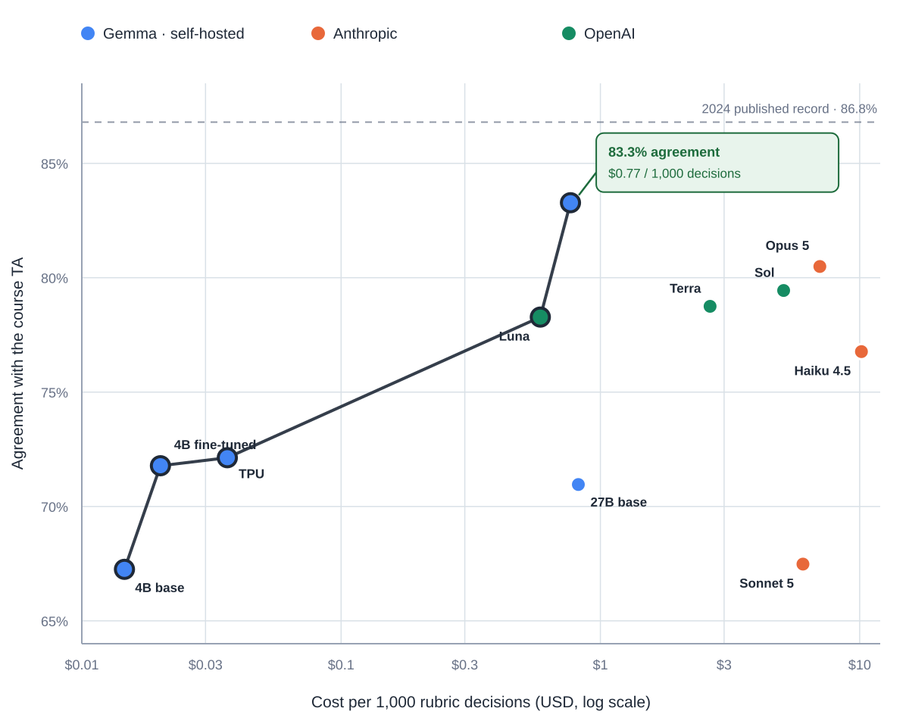
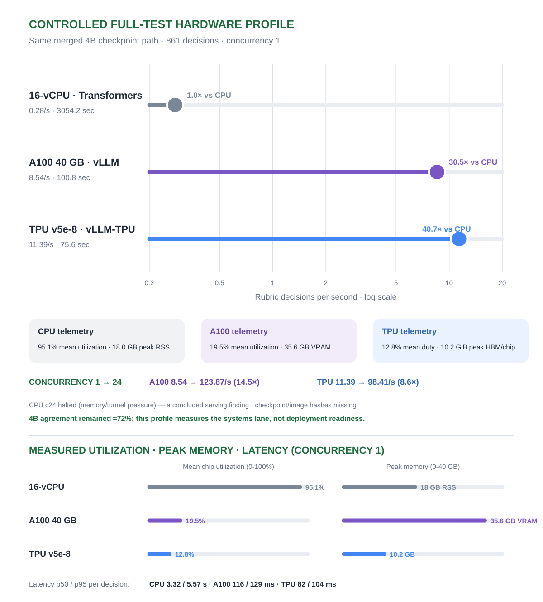
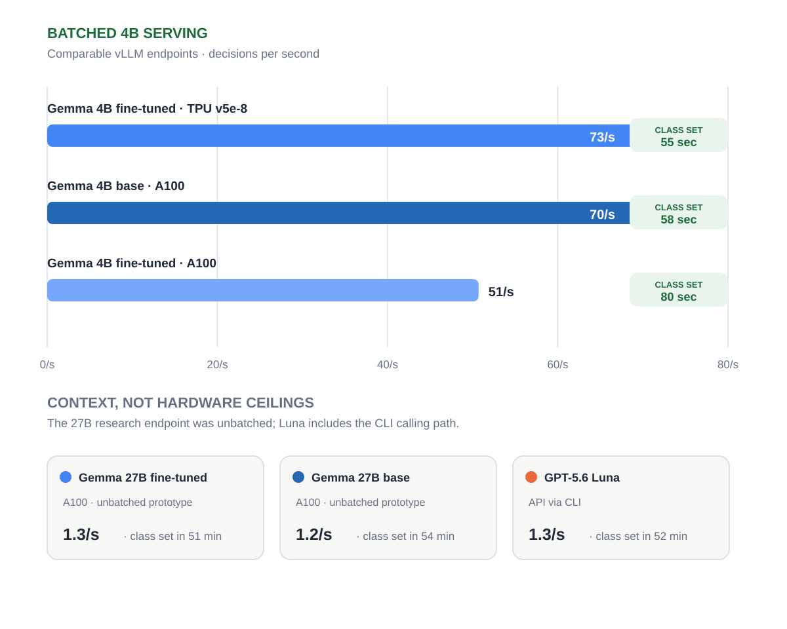

# Reproducible Grading Model Study

**A reproducible CPU/GPU/TPU study of rubric-level grading on RiceChem.**

[](https://github.com/seanyepez/me344ricechem/actions/workflows/ci.yml)
[](LICENSE)
[](https://www.python.org/)

> **Stanford ME344 (Summer 2026) — Final Project, Option 2: custom domain workload (individual).**
> Submission map: executive technical report = this README · configuration = [`Dockerfile`](Dockerfile), [`Dockerfile.tpu`](Dockerfile.tpu), [`k8s/`](k8s/) · profiling notebook = [`notebooks/hardware_profile.ipynb`](notebooks/hardware_profile.ipynb) · five-slide deck = [`slides/`](slides/) (PDF + PPTX).
> Course tooling used (three or more required): compute — CPU, NVIDIA A100, TPU v5e-8 · orchestration — Docker, Kubernetes/GKE · compilation — JAX/XLA, vLLM · telemetry — native node metrics and profiler receipts.

This repository is a reproducible grading-model study developed through Stanford ME344. It evaluates supervised fine-tuning and serving systems on **RiceChem**, a human-labeled benchmark for long-form chemistry grading. ME344 provides the systems context; the research question is broader: when can a tuned, locally served grader compete with general-purpose frontier inference?

The repository contains only the RiceChem experiment. It does **not** contain Treemarks product code, student records, RiceChem rows, model weights, credentials, private infrastructure identifiers, or frontier-model execution tooling.

## Start here

The repository has three progressively more demanding paths:

1. **Laptop smoke test — no dataset, model, accelerator, or network required**

   ```bash
   make smoke
   ```

   This verifies the metrics and paired-comparison path using synthetic rows. It is also what continuous integration runs.

2. **Local CPU or NVIDIA GPU**

   Use the CPU/GPU Docker targets and supply your own authorized RiceChem copy and model access. The evaluation interface is hardware-neutral; only the serving or training backend changes.

3. **Kubernetes, GKE, or TPU**

   Adapt the manifests under [`k8s/`](k8s/). TPU is an optional deployment profile, not a requirement for reproducing the analysis code or inspecting the aggregate results.

See [`docs/reproducibility.md`](docs/reproducibility.md) for the evidence ladder, environment expectations, and the boundary between a smoke test, a metric reproduction, and a full model reproduction.

The final assignment artifact is exactly five slides: [review the PDF](slides/ME344_RiceChem_Option2_5_Slides.pdf) or [download the PowerPoint](slides/ME344_RiceChem_Option2_5_Slides.pptx).

To regenerate and verify every public, dependency-free artifact in one command:

```bash
make verify
```

The verification gate checks every publishable filename and supported text payload,
including XML embedded in the PowerPoint. It rejects raw prediction files, non-allowlisted
CSVs, credentials, private cloud identifiers, private workspace paths, and absolute local
paths. PDF metadata and rendering are verified separately during release review.

## Executive summary

The experiment asks whether a smaller, fine-tuned open-weights model can perform rubric-level grading competitively with frontier models while lowering an API-equivalent serving-cost proxy and increasing throughput.

- Workload: 6,700 labeled training decisions, 831 validation decisions, and a frozen 861-decision canonical test set.
- Task: determine whether each student response satisfies one TA-authored rubric criterion; accuracy is exact agreement with the released TA label.
- Compute: Gemma 3 4B on one A100 GPU and TPU v5e-8; Gemma 3 27B on one A100 GPU.
- Main result: fine-tuning Gemma 3 27B increased canonical-test agreement from **71.0% to 83.3%** (+12.3 percentage points; response-clustered 95% CI +8.9 to +15.8; permutation p = .0001).
- Frontier comparison: Claude Opus 5 reached 80.5% on the same canonical test. The canonical-test difference was directional but not statistically significant (p = .10), so the supported conclusion is **competitive with Opus**, not superior to it.
- Systems result: the measured 27B endpoint was limited by an unbatched serving configuration. Its observed throughput is not an A100 hardware ceiling.
- Stability result: under the initial fine-tuning recipe, one of three seeds collapsed toward the majority class and was caught by the pre-declared validation gate; a stabilized recipe has passed the gate on all four seeds evaluated so far (canonical test 80.3–85.8%).

RiceChem is an external research benchmark, not evidence that any model is ready for unsupervised grading of record. Labels come from one course TA and published inter-rater reliability is unavailable.



The vector figures are regenerated directly from the aggregate receipts with
`make figures`; the generator has no third-party Python dependencies and reads no
row-level data.

The horizontal axis is a **provisional API-equivalent proxy**, not a bill or total
operating cost. [`results/cost_basis.json`](results/cost_basis.json) publishes the
official live pricing URLs, rate snapshot, aggregate token/runtime inputs, formulas,
pricing-mode assumptions, and unresolved historical-provenance limitations used to
reproduce every plotted value.

## System Topology Diagram


The raw dataset and canonical test rows remain on the authorized client. Training and validation are staged temporarily; the test prompts stream to private endpoints. No public model endpoint is required.

## Performance Delta Analysis

### Accuracy

| Model and setting | Canonical agreement |
|---|---:|
| Gemma 3 4B, base | 67.2% |
| Gemma 3 4B, fine-tuned on A100 | 71.8% |
| Gemma 3 4B, fine-tuned on TPU v5e-8 | 72.1% |
| Gemma 3 27B, base | 71.0% |
| **Gemma 3 27B, fine-tuned** | **83.3%** |
| Claude Opus 5, reference | 80.5% |
| RoBERTa-large-MNLI fine-tune, published record (2024) | 86.8% |
| RoBERTa-large-MNLI fine-tune, our replication (5 seeds) | 86.0% ± 1.0 |
| BART-large-MNLI fine-tune, our replication (5 seeds; published 85.4%) | 85.5% ± 1.3 |

Encoder replication seed values and the 27B multi-seed battery are tabulated in [`results/replication_summary.md`](results/replication_summary.md).

### Training and observed serving

| Lane | Training-loop time | Total elapsed | Training throughput | Observed inference throughput |
|---|---:|---:|---:|---:|
| Gemma 3 4B, TPU v5e-8 | 43.7 min | 44.4 min | 1,690 real tokens/s | 73.3 decisions/s |
| Gemma 3 4B, A100 | 90.7 min | 93.2 min | 816 real tokens/s | 50.7 decisions/s |
| Gemma 3 27B, A100 | 3.07 h | 3.18 h | 268 real tokens/s | 1.33 decisions/s† |
| Gemma 3 4B, 16-vCPU | Not trained | Not trained | Not measured | 0.28 decisions/s‡ |

†The 27B endpoint used unbatched Transformers generation. The 4B endpoints used vLLM with concurrent scheduling, so this is an observed deployment result rather than a controlled hardware ceiling.

‡The CPU result is the completed concurrency-1 serving profile of the same configured merged-checkpoint path. It took 3,054 seconds for all 861 decisions.

### Training stability (27B, multi-seed)

Fine-tune stability was measured rather than assumed. Under the initial 2-epoch recipe, one of three seeds collapsed toward the majority class (65.4% test agreement) and was caught by the pre-declared validation gate before any deployment decision. A stabilized recipe (3 epochs, effective batch 32, learning-rate warmup) then passed the gate on all four seeds evaluated so far, scoring 80.3–85.8% (mean 83.1%) on the canonical test; the fifth seed's evaluation was pending when this receipt was frozen. Seed-level values: [`results/replication_summary.md`](results/replication_summary.md).

Multiple training seeds characterize run-to-run variance only; they are not independent test samples. The primary fine-tuned-versus-base comparison remains the chronologically selected single-seed paired result reported in the executive summary.

### Controlled scaling pairs

The completed **training** evidence consists of two pairwise comparisons, not one
universal CPU/GPU/TPU ranking:

| Controlled pair | Baseline | Accelerator | Measured delta | Boundary |
|---|---:|---:|---:|---|
| RoBERTa-large-MNLI training | 16-vCPU: 0.0656 steps/s | A100: 1.87 steps/s | **28.5×** | Same encoder recipe; the 17.8-hour CPU total is projected from measured step time. |
| Gemma 3 4B training | A100: 816 real tokens/s | TPU v5e-8: 1,690 real tokens/s | **2.1×** | Same dataset and model family; configurations differed, so this is not a pure silicon comparison. |

The CPU aggregate receipt is [`results/cpu_encoder_reference.json`](results/cpu_encoder_reference.json).
Serving was profiled separately on the same configured merged-checkpoint path. The
completed concurrency-1 profile is:

| Hardware | Decisions/s | Full 861 | p50 / p95 | Utilization and memory |
|---|---:|---:|---:|---|
| 16-vCPU | 0.28 | 50.9 min | 3.32 / 5.57 s | 95.1% mean CPU; 18.0 GB peak RSS |
| A100 40 GB | 8.54 | 100.8 s | 116 / 129 ms | 19.5% mean GPU; 35.6 GB VRAM |
| TPU v5e-8 | 11.39 | 75.6 s | 82 / 104 ms | Device utilization/HBM unavailable; not estimated |

Relative to the CPU baseline, the A100 delivered **30.5×** and the TPU delivered
**40.7×** throughput at concurrency 1. At concurrency 24, the completed accelerator
rows reached 123.87 decisions/s on A100 and 98.41 decisions/s on TPU; the CPU row was
still incomplete. Checkpoint and serving-image hashes were not captured, so the public
receipt identifies this as a controlled workload result with incomplete binary provenance,
not an exact artifact-reproduction claim.

Reviewed aggregate receipts are under [`results/`](results/). The public matrix includes
only completed full-test rows and leaves missing telemetry unavailable.





## The Infrastructure Bottleneck Diagnosis

The primary operational bottleneck was **accelerator memory capacity**, hit three measured ways before any model learned anything:

1. **TPU HBM staging error:** pre-materialized JAX batch arrays (roughly 12 GB of attention masks alone) sat resident in device memory and starved the training program at any batch size. Keeping batches in host NumPy memory and transferring them per step freed the space; the declared batch then trained cleanly.
2. **GPU VRAM ceiling:** the 27B model fits on a 40 GB A100 only as 4-bit NF4 with gradient checkpointing; the naive configuration exceeded VRAM before completing a step.
3. **Storage-to-accelerator I/O starvation:** the first TPU job read its multi-gigabyte base checkpoint through an uncached object-store mount at roughly 200 KB/s (hours projected to load). Enabling range-read file caching cut model load to 12.4 seconds.

A separate serving-layer constraint: the measured 27B endpoint used unbatched, serialized generation, while the 4B endpoints used vLLM's dynamic batching, so the observed 27B throughput reflects server design as much as model size. Whether serving configuration was the dominant limit is **not established** — a batched 27B comparison has not been run — so that result is reported as a deployment observation, not a hardware ceiling.

## Engineering Mitigations

- Package dependencies in immutable CPU/GPU and TPU images; do not install packages inside running pods.
- Pin serving images and record their resolved digest.
- Use vLLM dynamic batching for throughput-oriented grading workloads.
- Keep preprocessing batches in host memory and transfer them per step.
- Cache large model reads close to the accelerator.
- Stream test prompts from the authorized client rather than storing test data with the serving system.
- Completed: CPU, GPU and TPU utilization, peak memory, latency and throughput are captured for the same configured checkpoint path ([`results/hardware_comparison.csv`](results/hardware_comparison.csv)); TPU device-level utilization and HBM were unavailable and are reported as unavailable rather than estimated. Remaining: record checkpoint and image digests so the comparison becomes exactly binary-reproducible.
- Treat the adapter validation gate as a deployment gate: it caught a majority-class training collapse before any deployment decision, at zero test-set cost.
- Validate the 27B bottleneck with a batched vLLM deployment before treating its earlier throughput as a model-size result.

## Repository layout

```text
.
├── Dockerfile                 # CPU and GPU build targets
├── Dockerfile.tpu             # JAX/Tunix TPU training image
├── src/                       # preparation, training, evaluation and metrics
├── k8s/                       # generic GKE jobs and deployments
├── results/                   # aggregate, de-identified experiment receipts
├── figures/                   # presentation-ready charts
├── notebooks/                 # profiling analysis (consumes aggregate CSV)
├── slides/                    # final five-slide ME344 deck
└── docs/                      # protocol and limitations
```

## Data access and preparation

RiceChem is not redistributed here. Obtain authorized access from the dataset authors and follow their terms. Place the released `processed/` directory under a local dataset root, then run:

```bash
python3 src/prepare_ricechem.py \
  --dataset-root /path/to/authorized/ricechem \
  --output-dir /path/to/work/ft_data
```

Preparation refuses to continue unless the frozen train, validation and test hashes match the experiment manifest. Do not commit the generated JSONL files.

## Container builds

Build the CPU or GPU target:

```bash
docker build --target cpu -t me344ricechem:cpu .
docker build --target gpu -t me344ricechem:gpu .
docker build -f Dockerfile.tpu -t me344ricechem:tpu .
```

The Kubernetes examples use environment substitution for project-specific service accounts, buckets, images and ConfigMap names. Base and checked-in serving images are digest-pinned; custom image variables must also be supplied as `@sha256:` references. No credential or infrastructure identifier is checked into the repository.

The CPU image starts a minimal private Transformers endpoint by default. The GPU and
TPU serving manifests use vLLM. The controlled matrix must record these serving
differences and should prefer the same merged 4B checkpoint across all three lanes.

### CPU endpoint and canonical evaluation

The following is a complete, copy-pasteable local path after authorized data has
been prepared and a merged Gemma checkpoint is available. Replace only the three
absolute paths:

```bash
export RICECHEM_MODEL_DIR=/absolute/path/to/gemma-3-4b-it-merged
export RICECHEM_DATA_DIR=/absolute/path/to/work/ft_data
export RICECHEM_OUTPUT_DIR=/absolute/path/to/local/results
mkdir -p "${RICECHEM_OUTPUT_DIR}"

docker build --target cpu -t me344ricechem:cpu .
docker run --rm -d --name ricechem-cpu \
  -p 127.0.0.1:8000:8000 \
  -e BIND_HOST=0.0.0.0 \
  -e MODEL_PATH=/models/gemma-3-4b-it-merged \
  -e DEVICE=cpu \
  -e TORCH_DTYPE=float32 \
  -v "${RICECHEM_MODEL_DIR}:/models/gemma-3-4b-it-merged:ro" \
  me344ricechem:cpu

until curl --fail --silent http://127.0.0.1:8000/health >/dev/null; do sleep 5; done

python3 src/evaluate_endpoint.py \
  --endpoint http://127.0.0.1:8000 \
  --model /models/gemma-3-4b-it-merged \
  --data-dir "${RICECHEM_DATA_DIR}" \
  --output "${RICECHEM_OUTPUT_DIR}/results_cpu_4b.jsonl" \
  --label cpu-4b \
  --workers 1

docker stop ricechem-cpu
```

`--workers 1` matches the CPU endpoint's explicit serialized-generation policy.
The full canonical evaluation still processes all 861 decisions; there is no subset
fallback.

### Gemma 27B QLoRA training on one NVIDIA GPU

This command reproduces the recorded 27B recipe on a CUDA host with enough VRAM.
It mounts the authorized split and model read-only and writes only adapters and
aggregate timing output to the selected output directory:

```bash
export RICECHEM_MODEL_DIR=/absolute/path/to/gemma-3-27b-it
export RICECHEM_DATA_DIR=/absolute/path/to/work/ft_data
export RICECHEM_OUTPUT_DIR=/absolute/path/to/work/outputs
export RICECHEM_SHUTDOWN_TOKEN="$(openssl rand -hex 32)"
mkdir -p "${RICECHEM_OUTPUT_DIR}"

docker build --target gpu -t me344ricechem:gpu .
docker run --rm --gpus all --ipc=host \
  -p 127.0.0.1:8000:8000 \
  -e BIND_HOST=0.0.0.0 \
  -e SHUTDOWN_TOKEN="${RICECHEM_SHUTDOWN_TOKEN}" \
  -e DATA_DIR=/data \
  -e MODEL_PATH=/models/gemma-3-27b-it \
  -e OUTPUT_DIR=/outputs/ricechem-lora-adapter-27b-gpu \
  -e BATCH_SIZE=2 \
  -e GRAD_ACCUM=8 \
  -e MAX_LEN=768 \
  -e EPOCHS=2 \
  -e LR=2e-4 \
  -e SEED=42 \
  -e PYTORCH_CUDA_ALLOC_CONF=expandable_segments:True \
  -v "${RICECHEM_DATA_DIR}:/data:ro" \
  -v "${RICECHEM_MODEL_DIR}:/models/gemma-3-27b-it:ro" \
  -v "${RICECHEM_OUTPUT_DIR}:/outputs" \
  --entrypoint python3 \
  me344ricechem:gpu src/train_gpu_27b.py
```

After training and adapter save, that process intentionally remains available on
port 8000 for the canonical evaluation. From a second terminal, run:

```bash
export RICECHEM_DATA_DIR=/absolute/path/to/work/ft_data
export RICECHEM_OUTPUT_DIR=/absolute/path/to/work/outputs
export RICECHEM_SHUTDOWN_TOKEN="paste-the-token-exported-in-the-training-terminal"

python3 src/evaluate_endpoint.py \
  --endpoint http://127.0.0.1:8000 \
  --model ft27b \
  --data-dir "${RICECHEM_DATA_DIR}" \
  --output "${RICECHEM_OUTPUT_DIR}/results_ft27b.jsonl" \
  --label ft27b \
  --workers 1

curl --request POST \
  --header "Authorization: Bearer ${RICECHEM_SHUTDOWN_TOKEN}" \
  http://127.0.0.1:8000/shutdown
```

The recorded configuration uses 4-bit NF4 base weights with rank-32 LoRA adapters;
it does not update or redistribute the base model.

## Evaluation

Against a private OpenAI-compatible endpoint:

```bash
python3 src/evaluate_endpoint.py \
  --endpoint http://127.0.0.1:8000 \
  --model /models/gemma-3-4b-it \
  --data-dir /path/to/work/ft_data \
  --output results/results_cpu_4b.jsonl \
  --label cpu-4b \
  --workers 24
```

The ME344 comparison uses all 861 canonical decisions; it has no subset fallback.

To run the profiling notebook against the public aggregate receipts:

```bash
python3 -m pip install -r requirements-analysis.txt
jupyter lab notebooks/hardware_profile.ipynb
```

The notebook runs without row-level RiceChem data. If a completed
`results/hardware_comparison.csv` is present, it validates and displays that controlled
matrix as an additional section; otherwise it reports the matrix as unavailable and does
not infer missing telemetry.

## Current conclusion

Fine-tuning shows promise on held-out responses to the same questions and rubrics used during training. It has not yet demonstrated reliable transfer to a newly authored assessment. The practical deployment decision also remains open: assignment-specific fine-tuning has labeling, training, validation, serving, and failure-monitoring costs that must be compared with the higher marginal inference cost of a general-purpose frontier model.

The next decisive experiment is leave-one-question-out evaluation: train on three RiceChem questions, test on the completely unseen fourth, and repeat across all four folds and multiple seeds.

## Limitations

- Agreement is measured against one TA's binary labels, not an adjudicated multi-rater gold standard.
- The benchmark contains four chemistry questions from one course offering.
- The canonical Gemma 27B versus Opus difference is not statistically significant (decision-level exact McNemar p = .10364; response-clustered permutation p = .12739).
- Fine-tuning runs can fail or collapse; validation gates are required before deployment. Observed: one of three seeds under the initial recipe collapsed and was caught by the gate; a stabilized recipe has passed on all four seeds evaluated since, with the fifth pending.
- The controlled serving rows share a configured checkpoint path, but checkpoint and image hashes were not captured; exact binary reproduction remains incomplete.
- Total operating cost per assessment has not yet been measured; the current figure is a provisional API-equivalent inference proxy and excludes the complete labeling, validation, monitoring, idle-capacity, and human-review workflow.

## References

- Sonkar et al. (2024), *Automated Long Answer Grading with RiceChem Dataset*, [arXiv:2404.14316](https://arxiv.org/abs/2404.14316).
- Rao and Callison-Burch (2026), *Autorubric: A Unifying Framework for Rubric-Based LLM Evaluation on Non-Verifiable Tasks*, [arXiv:2603.00077](https://arxiv.org/abs/2603.00077).
- Ferrer et al. (2026), *When Can We Trust LLM Graders? Calibrating Confidence for Automated Assessment*, [arXiv:2603.29559](https://arxiv.org/abs/2603.29559).
- [Google Tunix](https://github.com/google/tunix).
- [vLLM TPU documentation](https://docs.vllm.ai/projects/tpu/en/latest/).

## License

Code in this repository is released under the Apache License 2.0. RiceChem data, Gemma model weights and referenced third-party materials retain their own licenses and access terms.
